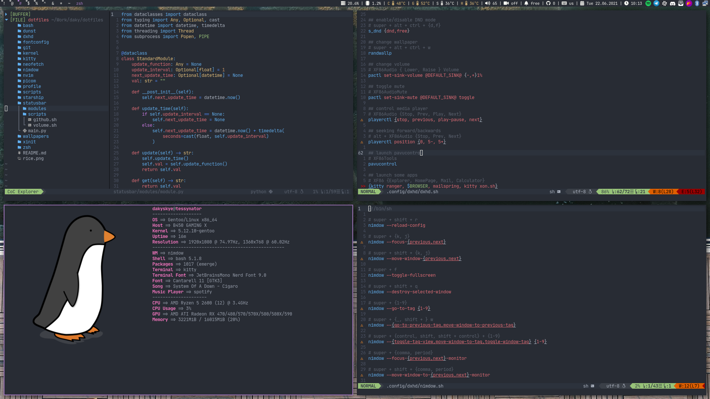

# dotfiles

My personal macOS developer dotfiles — a terminal-first setup built around Neovim, Tmux, and Zsh, with deep git integration, multiple LSPs, and automatic light/dark theme switching.


> Also check out the [Gentoo branch](https://github.com/dakyskye/dotfiles/tree/gentoo) for the Linux rice.
>
> 

---

## Table of Contents

- [Overview](#overview)
- [Structure](#structure)
- [Shell — Zsh](#shell--zsh)
- [Editor — Neovim](#editor--neovim)
- [Terminal Multiplexer — Tmux](#terminal-multiplexer--tmux)
- [Prompt — Starship](#prompt--starship)
- [Keyboard — Karabiner](#keyboard--karabiner)
- [Terminal — iTerm2](#terminal--iterm2)
- [Git](#git)
- [Environment & Scripts](#environment--scripts)
- [Theme](#theme)

---

## Overview

| Tool | Purpose |
|------|---------|
| [Zsh](https://www.zsh.org) + [Antigen](https://github.com/zsh-users/antigen) | Shell with plugin management |
| [Neovim](https://neovim.io) + [vim-plug](https://github.com/junegunn/vim-plug) | Primary editor |
| [Tmux](https://github.com/tmux/tmux) | Terminal multiplexer |
| [Starship](https://starship.rs) | Cross-shell prompt |
| [Karabiner-Elements](https://karabiner-elements.pqrs.org) | Keyboard remapping |
| [iTerm2](https://iterm2.com) | Terminal emulator |

**Colorscheme**: [OneDark](https://github.com/navarasu/onedark.nvim), automatically synced to macOS system light/dark mode across all tools.

---

## Structure

```
Dotfiles/
├── nvim/          # Neovim configuration (Lua + Vimscript)
├── tmux/          # Tmux configuration
├── zsh/           # Zsh shell configuration
├── starship/      # Starship prompt configuration
├── git/           # Git configuration
├── karabiner/     # Karabiner keyboard remapping
├── iTerm2/        # iTerm2 profiles and color scheme
├── profile/       # Shell profile (environment variables, PATH)
└── scripts/       # Utility scripts
```

---

## Shell — Zsh

**Config**: `zsh/`

### Plugins (via Antigen)

| Plugin | Purpose |
|--------|---------|
| `zsh-users/zsh-completions` | Enhanced tab completions |
| `zsh-users/zsh-autosuggestions` | Fish-style history suggestions |
| `zsh-users/zsh-history-substring-search` | Up/down search through history |
| `zsh-users/zsh-syntax-highlighting` | Real-time command syntax highlighting |
| `jeffreytse/zsh-vi-mode` | Vi keybinding mode |

### History

- 500,000 entries in memory, 1,000,000 saved to disk
- Deduplication enabled, shared across sessions

### Key Aliases

| Alias | Command |
|-------|---------|
| `vim` | `nvim` |
| `ls / la / ll / lg / lh` | `eza`-based listings with icons/git info |
| `rgf / rgfh` | Ripgrep file search (normal / include hidden) |
| `d` | `docker` |
| `cputemp / fanspeed` | System temperature/fan monitoring |

### Functions

- `t <name>` — Create or attach to a tmux session by name (with tab completion)
- `rgd / rgdh` — Ripgrep directory search with configurable depth

---

## Editor — Neovim

**Config**: `nvim/`

### Core Settings

- Relative + absolute line numbers
- 4-space indentation
- System clipboard integration (`unnamedplus`)
- No swap/backup files
- Case-insensitive search with smart case
- True color (24-bit) + 256 color support
- Mouse support enabled

### Plugins (via vim-plug)

#### UI
| Plugin | Purpose |
|--------|---------|
| `navarasu/onedark.nvim` | Colorscheme |
| `f-person/auto-dark-mode.nvim` | Sync theme with macOS light/dark mode |
| `nvim-lualine/lualine.nvim` | Status line |
| `nvim-tree/nvim-tree.lua` | File explorer |
| `folke/which-key.nvim` | Keybinding popup help |
| `nvim-tree/nvim-web-devicons` | File type icons |

#### Git
| Plugin | Purpose |
|--------|---------|
| `lewis6991/gitsigns.nvim` | Inline blame, hunk staging/navigation |
| `tpope/vim-fugitive` | Full git integration |
| `junegunn/gv.vim` | Git log browser |

#### Editing
| Plugin | Purpose |
|--------|---------|
| `tpope/vim-commentary` | Comment/uncomment with `gc` |
| `tpope/vim-surround` | Surround text objects |
| `windwp/nvim-autopairs` | Auto-close brackets/quotes |
| `andymass/vim-matchup` | Enhanced `%` matching |
| `editorconfig/editorconfig-vim` | EditorConfig support |

#### LSP & Completion
| Plugin | Purpose |
|--------|---------|
| `neovim/nvim-lspconfig` | LSP configuration |
| `nvim-treesitter/nvim-treesitter` | Syntax parsing and highlighting |
| `hrsh7th/nvim-cmp` | Completion engine |
| `hrsh7th/vim-vsnip` | Snippet engine |
| `ray-x/lsp_signature.nvim` | Function signature help |
| `nvim-telescope/telescope.nvim` | Fuzzy finder |

### Configured Language Servers

`bashls`, `gopls`, `golangci_lint_ls`, `lua_ls`, `pyright`, `jsonls`, `ts_ls`, `vimls`, `dockerls`, `docker_compose_language_service`, `tailwindcss`

Go files are auto-formatted on save.

### Key Bindings

**Leader key**: `<Space>`

#### File & Search
| Key | Action |
|-----|--------|
| `<Leader>ff` | Find files (Telescope) |
| `<Leader>fg` | Live grep (Telescope) |
| `<Leader>fb` | Browse open buffers |
| `<Leader>fh` | Search help tags |
| `<Leader>e` | Toggle file explorer |
| `<Leader>gf` | Open file under cursor |

#### LSP
| Key | Action |
|-----|--------|
| `gd` | Go to definition |
| `gD` | Go to declaration |
| `gi` | Go to implementation |
| `gr` | Show references |
| `K` | Hover documentation |
| `<C-k>` | Signature help |
| `<Leader>rn` | Rename symbol |
| `<Leader>ca` | Code actions |
| `<Leader>f` | Format buffer |
| `<Leader>d` | Show diagnostics float |
| `[d` / `]d` | Previous/next diagnostic |

#### Git (gitsigns)
| Key | Action |
|-----|--------|
| `]c` / `[c` | Next/previous hunk |
| `<Leader>hs` | Stage hunk |
| `<Leader>hr` | Reset hunk |
| `<Leader>hS` | Stage buffer |
| `<Leader>hp` | Preview hunk |
| `<Leader>hb` | Full blame for line |
| `<Leader>tb` | Toggle inline blame |
| `<Leader>hd` | Diff this |

#### Splits & Buffers
| Key | Action |
|-----|--------|
| `<C-w>%` | Vertical split (tmux-style) |
| `<C-w>"` | Horizontal split (tmux-style) |
| `<M-h/j/k/l>` | Resize splits |
| `[b` / `]b` | Previous/next buffer |

---

## Terminal Multiplexer — Tmux

**Config**: `tmux/`

### General

- **Prefix**: `C-a` (replaces default `C-b`)
- 50,000 line scrollback history
- Mouse support enabled
- Windows automatically renumbered on close
- 0ms escape delay

### Navigation

| Key | Action |
|-----|--------|
| `C-h/j/k/l` | Navigate panes (Vim-style) |
| `M-h/j/k/l` | Resize panes |
| `[` / `]` | Swap window left/right |
| `=` | Tiled layout |
| `y` (copy mode) | Copy to system clipboard via `pbcopy` |

### Status Bar

Dynamically adapts to macOS light/dark mode:
- **Dark**: OneDark palette (`#282c34` background)
- **Light**: Light gray palette

Shows: session name, hostname, current time.

---

## Prompt — Starship

**Config**: `starship/starship.toml`

- Username always shown
- Git branch with remote tracking visibility
- Git commit hash display
- Git metrics (insertions/deletions)
- Shell indicator (purple)
- Nerd Font icons for all language version modules: Go, Python, Node.js, Rust, Lua, TypeScript, Java, Ruby, Kotlin, Swift, Zig, PHP, Perl, Haskell, Elixir, Elm, Scala, OCaml, Dart, Crystal, Julia, and more
- OS icons for macOS, Arch, Gentoo, and generic Linux

---

## Keyboard — Karabiner

**Config**: `karabiner/`

**Core concept**: Caps Lock becomes a **Hyper key** — when held, it activates a custom layer for window management and app launching.

### Window Management (Caps + key)

| Key | Action |
|-----|--------|
| `H` | Snap window to left half |
| `L` | Snap window to right half |
| `J` | Snap window to bottom half |
| `K` | Snap window to top half |
| `F` | Maximize / fill screen |
| `C` | Center window |

### App Launchers (Caps + key)

| Key | App |
|-----|-----|
| `E` | Finder |
| `T` | iTerm2 |
| `P` | System Settings |
| `W` | Safari |
| `S` | Spotify |
| `N` | Notes |
| `M` | Messages |
| `V` | ProtonVPN |
| `D` | OrbStack |
| `G` | GitHub profile |
| `Y` | YouTube |

---

## Terminal — iTerm2

**Config**: `iTerm2/`

- OneDark-inspired color scheme (dark background: `#202020`)
- Vibrant ANSI colors
- Background transparency with blur
- Mouse reporting enabled
- 1,000 line scrollback
- Non-ASCII anti-aliasing

---

## Git

**Config**: `git/`

- Default branch: `master`
- Pull strategy: rebase
- Compact log format (`oneline` with abbreviated hashes)
- HTTPS → SSH automatic conversion for GitHub
- Conditional config inclusion (e.g., per-directory work configs)

---

## Environment & Scripts

**Profile**: `profile/`

| Variable | Value |
|----------|-------|
| `EDITOR` | `nvim` |
| `CONFIG` | `$HOME/.config` |
| `WORK` | `$HOME/Work` |
| `GOPATH` | `$HOME/go` |
| `SCRIPTS` | `$HOME/.scripts` |

PATH includes: Go binaries, Cargo (Rust), pipx, and custom scripts.

**Scripts**: `scripts/`

- `nvim_quicklaunch` — Opens a scratch Neovim buffer and copies output to clipboard on exit

---

## Theme

**OneDark** across all tools, automatically synced with macOS system appearance:

- Neovim → `auto-dark-mode.nvim` calls `nvim_ostheme` script on appearance change
- Tmux → status bar reads macOS dark mode state at refresh
- iTerm2 → OneDark-based color profile

Nerd Fonts are required for icons in Starship, nvim-tree, and lualine.
